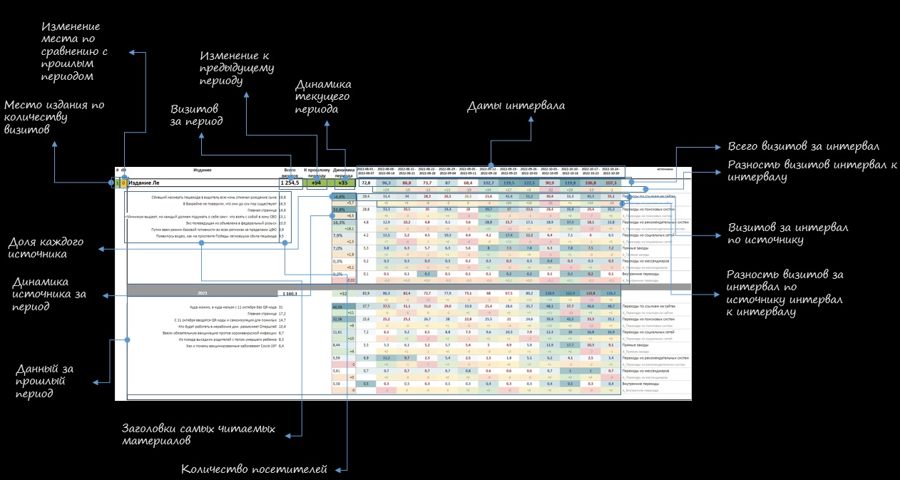

# get_metrics
script for getting sites' metrics
Скрипт для получения аналитики из Яндекс метрики.

# Запуск
Сохраняете номера ваших счётчиков в файл counters.json по схеме "название счётчика":"номер счётчика", в файле config.py прописываете ваш токен от метрики, указываете основной период (date1, date2) и период для сравнения (date11, date22). Запсукаете get_metric.

# Результат
Результат сохраняется в табличку excel в папку reports/
Получаемые данные: 

- количество визитов за период,
- изменение по сравнению с прошлым периодом
- разбивка периода на интервалы (по умолчанию недели)
- данные по источникам трафика по интервалам и в целом
- топ заголовков самых читаемых материалов

Есть фильтр по региону
Если счётчиков несколько, издания ранжируются по количеству визитов.

После применения оформления, получается примерно такая таблица:

